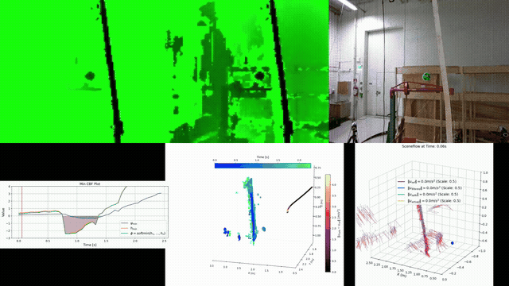

# Quadrotor Scene Flow CBF

> Real-time, onboard collision avoidance for quadrotors using dense scene flow and control barrier functions.



**Morten Svendgård** — [NTNU](https://www.ntnu.edu/) & [UC Berkeley](https://www.berkeley.edu/) alumnus | [Google Scholar](https://scholar.google.com/citations?user=XRmsAOwAAAAJ&hl=en) | [LinkedIn](https://www.linkedin.com/in/morten-svendg%C3%A5rd-327971152/)

This is the code for my master's thesis:

> **Safe Navigation in Dynamic Environments Using Control Barrier Functions and an RGB-D Camera**
> Master's thesis in Cybernetics and Robotics, June 2025
> Supervisor: Kostas Alexis | Co-supervisor: Marvin Harms
> Norwegian University of Science and Technology, Dept. of Engineering Cybernetics

Full thesis: [`svendgard_safe_navigation_in_dynamic_environments.pdf`](svendgard_safe_navigation_in_dynamic_environments.pdf) | [Official publication (NVA)](https://nva.sikt.no/registration/0199c391549a-25685d91-b5b0-4e4c-afd7-fe13463aa9f3)

---

## What this is

A quadrotor that can dodge obstacles — including moving ones — using only an RGB-D camera and an IMU. No external tracking, no pre-built maps, no offboard compute.

The pipeline runs entirely **onboard** an NVIDIA Jetson Orin NX at **20+ Hz**:

1. Capture RGB-D frames (Intel RealSense D445)
2. Estimate dense scene flow (adapted from [PD-Flow](https://github.com/MarianoJT88/PD-Flow))
3. Evaluate a soft-min composite control barrier function (CBF)
4. Output safe velocity corrections

The CBF reasons directly about per-pixel depth and velocity, so it naturally handles dynamic obstacles without needing object detection or tracking. CUDA acceleration makes the whole thing fast enough for real-time flight.

To our knowledge, this is the first demonstration of real-time scene flow estimation (excluding deep learning methods) integrated with CBFs, running onboard a quadrotor.

---

## Experiment videos

| Experiment | Link |
|---|---|
| Wall — straight on | [YouTube](https://youtu.be/VCkkEaoVhmw) |
| Wall — sliding | [YouTube](https://youtu.be/xyKbTvXlR3o) |
| **Dynamic obstacle** | [**YouTube**](https://youtu.be/t6zSgrP5Or4) |
| Field of view | [YouTube](https://youtu.be/FNKtGVA5ZqU) |

---

## Repo structure

```
├── svendgard_safe_navigation_in_dynamic_environments.pdf
├── code_quadrotor/                        # C++/CUDA + ROS onboard pipeline
│   ├── src/apps/                          #   Core source (scene flow, CBF, main app)
│   ├── include/                           #   Headers
│   ├── config/                            #   CBF parameter files (YAML)
│   ├── ros1_ws/                           #   ROS Noetic workspace
│   └── ros_ws/                            #   ROS 2 workspace (experimental)
└── media/                                 # GIF for this README
```

---

## Building

> **Research code** — expects a specific hardware/software stack. Your mileage may vary.

**Dependencies:** CUDA, ROS Noetic, OpenCV, Eigen3, yaml-cpp, Intel RealSense SDK

```bash
cd code_quadrotor
source /opt/ros/noetic/setup.bash
./build20.sh
```

The CMake config targets CUDA arch `87` (Jetson Orin NX). Change `CUDA_ARCH_BIN` / `CUDA_ARCH_PTX` in `code_quadrotor/CMakeLists.txt` for other GPUs.

---

## Related repos

- [ros_results_analysis](https://github.com/MSNetrom/ros_results_analysis) — scripts for generating results from rosbag files
- [NavigationToyGym](https://github.com/MSNetrom/NavigationToyGym) — 2D CBF simulator (Pygame)

## Acknowledgments

The scene flow estimator builds on **PD-Flow**:

- Code: [MarianoJT88/PD-Flow](https://github.com/MarianoJT88/PD-Flow)
- Paper: [A Primal-Dual Framework for Real-Time Dense RGB-D Scene Flow](https://cvg.cit.tum.de/_media/spezial/bib/jaimez_et_al_15.pdf) — Jaimez et al., ICRA 2015

---

## Citation

If you use this work, please cite:

```bibtex
@mastersthesis{svendgaard2025safe_navigation,
  author = {Morten Svendg{\aa}rd},
  title  = {Safe Navigation in Dynamic Environments Using Control Barrier Functions and an {RGB-D} Camera},
  school = {Norwegian University of Science and Technology},
  type   = {Master's thesis in Cybernetics and Robotics},
  year   = {2025},
  month  = jun,
  note   = {Supervisor: Kostas Alexis; Co-supervisor: Marvin Harms}
}
```

And the scene flow method:

```bibtex
@inproceedings{jaimez15icra,
  author    = {M. Jaimez and M. Souiai and J. Gonzalez-Jimenez and D. Cremers},
  title     = {A Primal-Dual Framework for Real-Time Dense {RGB-D} Scene Flow},
  booktitle = {Proc. of the IEEE Int. Conf. on Robotics and Automation (ICRA)},
  year      = {2015},
  pages     = {98--104},
  doi       = {10.1109/ICRA.2015.7138986}
}
```

## License

Includes PD-Flow-derived components released under GPLv3. See [`code_quadrotor/GPL LICENSE.txt`](code_quadrotor/GPL%20LICENSE.txt).
